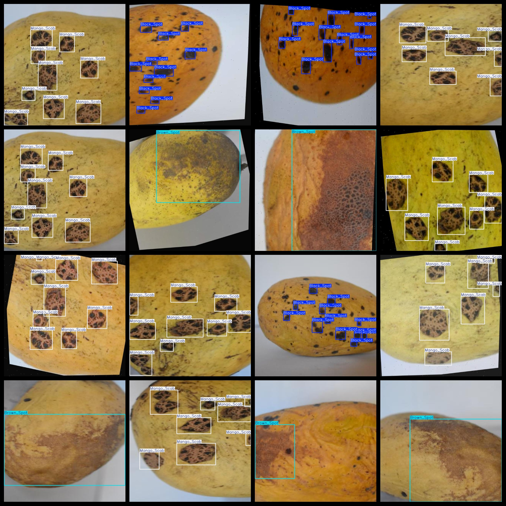

# Mango Disease Dataset 6593 imagesVOC+YOLO format (Augmented)

The Mango Disease dataset consists of 6593 images in the VOC+YOLO format (enhanced).

The dataset is formatted as follows: VOC format combined with YOLO format.

The package includes three folders containing images, XML files, and TXT files.

The JPEGImages folder contains a total of 6593 jpg images.

The Annotations folder contains a total of 6593 XML files.

The labels folder contains a total of 6593 TXT files.

There are a total of 3 categories of labels: ["Black_Spot", "Brown_Spot", "Mango_Scab"].

The labels correspond to the following Chinese names: ["Black Spot Disease", "Brown Spot Disease", "Mango Scab Disease"].

Each label's number of bounding boxes (note that the order in the YOLO format categories does not match this, but is based on the classes.txt in the labels folder):

- Black_Spot bounding boxes = 27293
- Brown_Spot bounding boxes = 2231
- Mango_Scab bounding boxes = 17717

Total number of bounding boxes = 47241

The image resolution is clear.

The images have been enhanced.

GitHub repository location: datasets_sl

The shape of the labels is a rectangular box, used for target detection recognition.

Important note: No zero-one classification is present.

Special declaration: The dataset does not guarantee any accuracy or precision of models trained on it or weight files. The dataset only provides accurate and reasonable annotations.

Annotation and picture conditions are as follows:
## Images

---

Here is a pay link on Stripe (https://buy.stripe.com/3cs8yP7sY87d0vu9AB). Please contact me lonlonago@foxmail.com after funding $89, and I will send you a complete data files, thank you!

